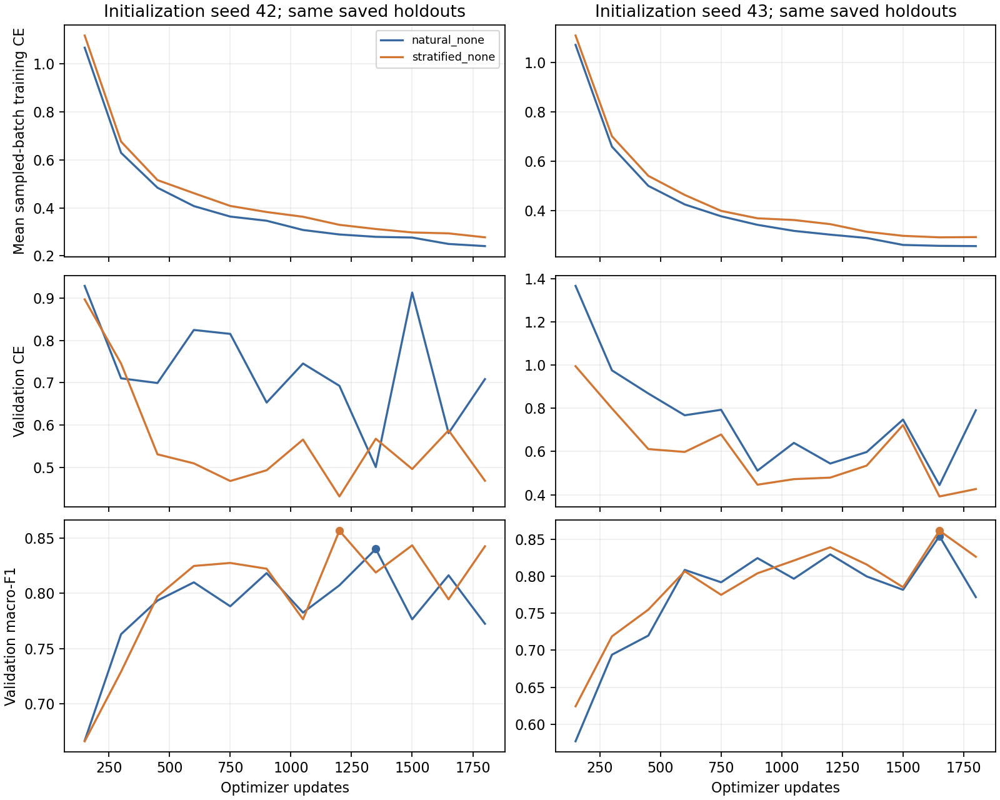

# Paired SemiWaferNet short diagnostics

Four matched 1,800-update runs use the full classification architecture, LR 0.0002 and fixed source-data seed 42. Initialization seeds 42 and 43 each compare natural None sampling with size-stratified None sampling. Validation and stress filenames are identical across all four runs; non-None training roles are unchanged. All images come from official Training. No official Test metrics are reported.

Checkpoints are selected by the earliest maximum of saved validation macro-F1. The shared stress score and size bins are descriptive. Values below are percentages.

| Seed | Arm | Best update | Val accuracy | Val macro-F1 | Stress accuracy | Stress macro-F1 | Val None F1 | Val Scratch F1 | Process seconds |
|---|---|---:|---:|---:|---:|---:|---:|---:|---:|
| 42 | natural_none | 1350 | 80.42 | 84.00 | 91.11 | 74.26 | 74.23 | 47.97 | 114.5 |
| 42 | stratified_none | 1200 | 84.96 | 85.66 | 88.70 | 70.89 | 85.86 | 54.37 | 115.4 |
| 43 | natural_none | 1650 | 82.24 | 85.45 | 92.90 | 77.86 | 77.23 | 48.28 | 124.2 |
| 43 | stratified_none | 1650 | 84.96 | 86.19 | 85.60 | 67.38 | 83.77 | 51.79 | 129.0 |

| Shared subset | Metric | Mean paired delta, stratified minus natural (pp) | Sample SD (pp) |
|---|---|---:|---:|
| validation | accuracy | +3.63 | 1.28 |
| validation | macro_f1 | +1.19 | 0.65 |
| validation | balanced_accuracy | +0.99 | 0.09 |
| validation | none_f1 | +9.09 | 3.60 |
| validation | scratch_f1 | +4.95 | 2.04 |
| validation | none_to_scratch_fpr | -14.50 | 5.42 |
| stress | accuracy | -4.86 | 3.46 |
| stress | macro_f1 | -6.92 | 5.03 |
| stress | balanced_accuracy | -1.09 | 0.15 |
| stress | none_f1 | -2.87 | 2.10 |
| stress | scratch_f1 | -5.57 | 2.94 |
| stress | none_to_scratch_fpr | +2.01 | 1.92 |

MC gate diagnostics use the first saved validation samples per class, with the published thresholds unchanged. Their adaptive confidence statistics come from this held-out subset rather than real unlabeled Du, so coverage does not establish full SSL quality.

| Seed | Arm | MC samples | Confidence pass | Entropy pass | MI pass | All gates | Accepted accuracy |
|---|---|---:|---:|---:|---:|---:|---:|
| 42 | natural_none | 170 | 78 | 53 | 155 | 53 | 100.00% |
| 42 | stratified_none | 170 | 63 | 46 | 157 | 46 | 100.00% |
| 43 | natural_none | 170 | 86 | 60 | 162 | 60 | 100.00% |
| 43 | stratified_none | 170 | 80 | 58 | 152 | 58 | 100.00% |

CPU raw-size diagnostic status: **complete**. False-positive rates below mean predicted Scratch among true None within each original occupied-die-count bin.

| Seed | Arm | Holdout | Raw occupied dies | None count | None→Scratch count | FPR |
|---|---|---|---|---:|---:|---:|
| 42 | natural_none | validation | under700 | 100 | 0 | 0.00% |
| 42 | natural_none | validation | 700_to2499 | 100 | 22 | 22.00% |
| 42 | natural_none | validation | at_least2500 | 100 | 74 | 74.00% |
| 42 | natural_none | stress | under700 | 7232 | 6 | 0.08% |
| 42 | natural_none | stress | 700_to2499 | 1680 | 272 | 16.19% |
| 42 | natural_none | stress | at_least2500 | 388 | 273 | 70.36% |
| 42 | stratified_none | validation | under700 | 100 | 4 | 4.00% |
| 42 | stratified_none | validation | 700_to2499 | 100 | 15 | 15.00% |
| 42 | stratified_none | validation | at_least2500 | 100 | 22 | 22.00% |
| 42 | stratified_none | stress | under700 | 7232 | 242 | 3.35% |
| 42 | stratified_none | stress | 700_to2499 | 1680 | 263 | 15.65% |
| 42 | stratified_none | stress | at_least2500 | 388 | 107 | 27.58% |
| 43 | natural_none | validation | under700 | 100 | 1 | 1.00% |
| 43 | natural_none | validation | 700_to2499 | 100 | 14 | 14.00% |
| 43 | natural_none | validation | at_least2500 | 100 | 71 | 71.00% |
| 43 | natural_none | stress | under700 | 7232 | 4 | 0.06% |
| 43 | natural_none | stress | 700_to2499 | 1680 | 197 | 11.73% |
| 43 | natural_none | stress | at_least2500 | 388 | 253 | 65.21% |
| 43 | stratified_none | validation | under700 | 100 | 16 | 16.00% |
| 43 | stratified_none | validation | 700_to2499 | 100 | 16 | 16.00% |
| 43 | stratified_none | validation | at_least2500 | 100 | 22 | 22.00% |
| 43 | stratified_none | stress | under700 | 7232 | 487 | 6.73% |
| 43 | stratified_none | stress | 700_to2499 | 1680 | 198 | 11.79% |
| 43 | stratified_none | stress | at_least2500 | 388 | 82 | 21.13% |

CPU pass wall times: 60.0s (budget_reached, 0 caches reused); 17.0s (complete, 3 caches reused). A budget-limited partial model is not published as a complete cache.

Exact checkpoint hashes, all per-class metrics/confusions, run timings, gate counts and paired means/sample SD are in `paired_summary.json`. Two initialization seeds provide a diagnostic comparison, not a reliable population uncertainty estimate or paper reproduction.
